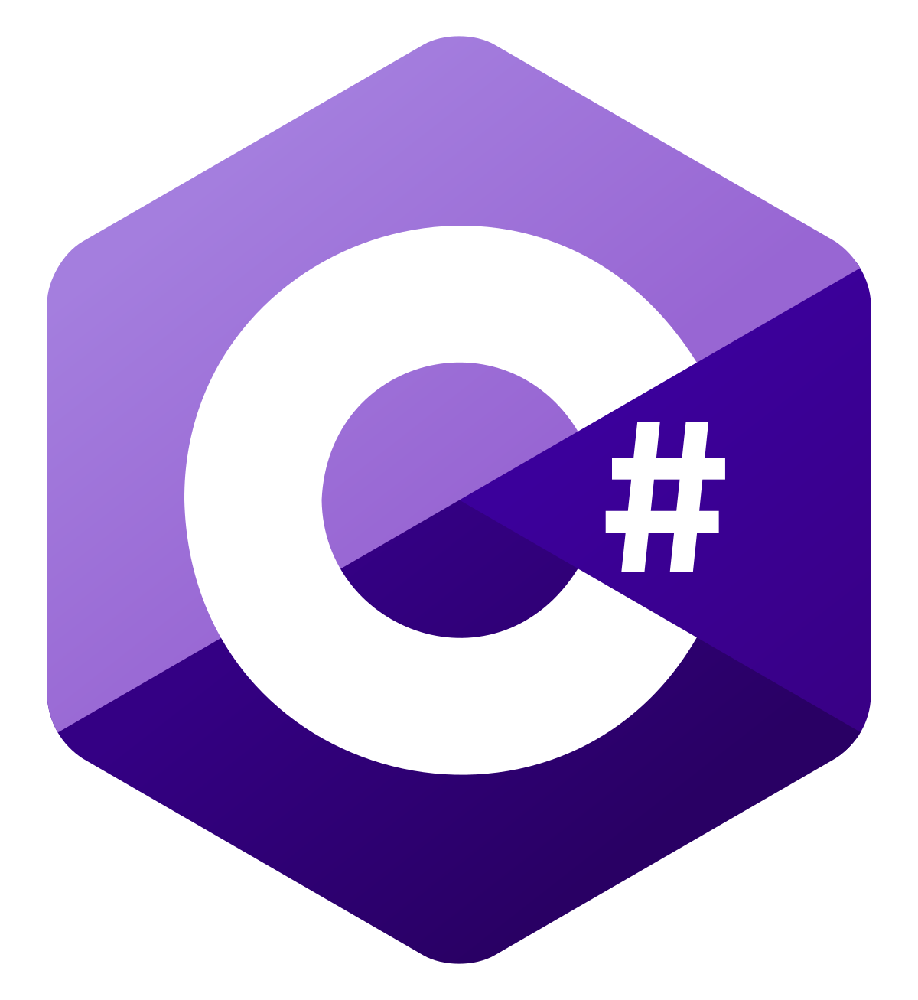

 ## 
 Daniel Alves 

He/Him | 🏳️‍🌈 | Vegetarian | ☭ | PT EN ES 

### Social Media
      

### Code + Web
  

<!--
**coolalves/coolalves** is a ✨ _special_ ✨ repository because its `README.md` (this file) appears on your GitHub profile.

 
